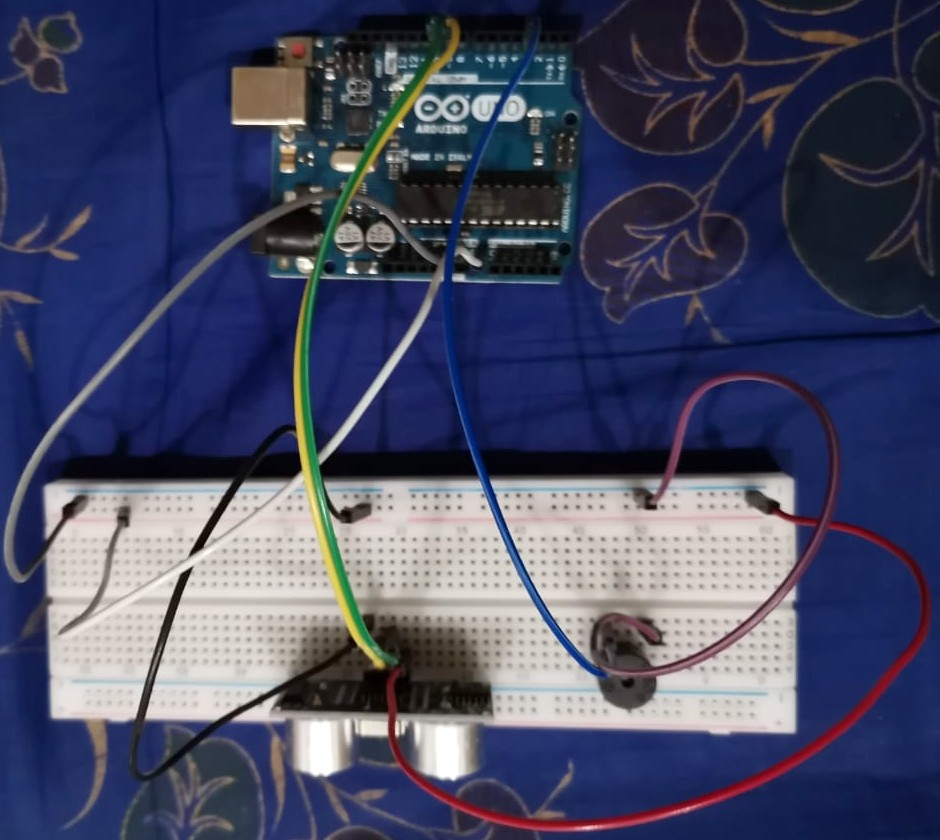
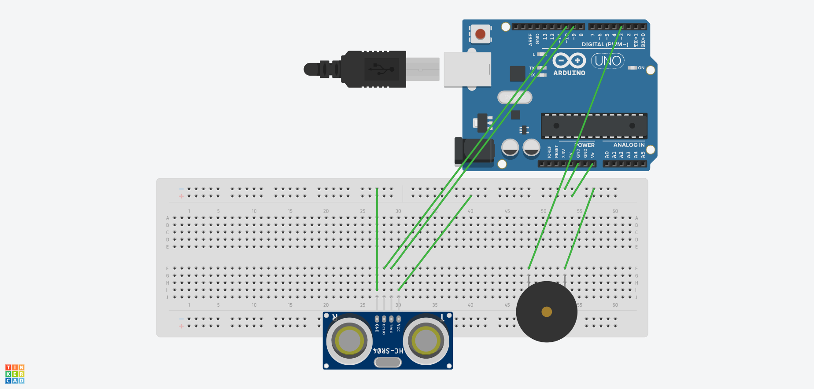

I have had a curved back since as long as I can remember. A big contributor towards it, is my sitting posture. I decided to do something about that.
In this project, I use arduino uno, a distance sensor, and a buzzer to regularly check for my posture and estimate if my back is curved a bit too much. If it is, the buzzer goes off to remind me to sit straight.

Components:
- 1 Arduino piezo buzzer
- 1 ultrasonic distance sensor
- 1 arduino uno board
- 8 male-to-male wires
- 1 breadboard

Connection:

Circuit Diagram:
